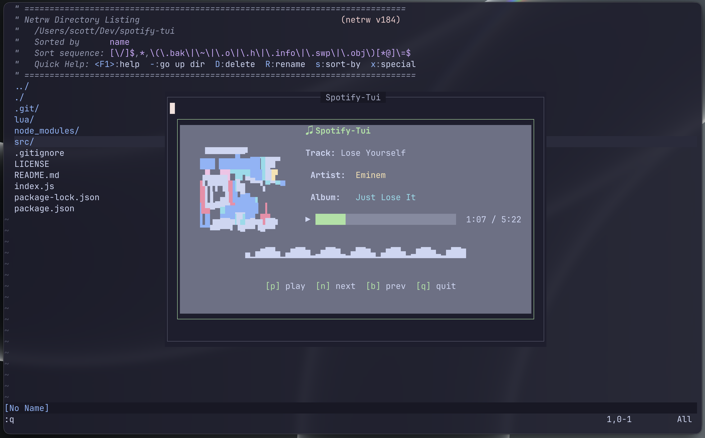

# spotify-tui.nvim

A Spotify TUI that floats inside Neovim like [Harpoon](https://github.com/ThePrimeagen/harpoon). Press `<leader>sp` to open a centered window showing your current playback, album art, progress bar, animated equalizer, and controls.



```
╭─────────────────────────────────────────────────────────────╮
│                     ♫ Spotify-Tui                            │
│  ┌──────────────────┐                                       │
│  │   █▄ ▄█▀▀█▄ ▄█▀  │  Track: Song Name                    │
│  │   █▀▀ █▄▄█ ▀▀█    │                                       │
│  │   ▀  ▀  ▀  ▀      │   Artist: Artist Name                │
│  └──────────────────┘  │                                       │
│                         │   Album: Album Name                  │
│                         │                                       │
│                         │  ▶ ████████████████░░░░  1:23 / 3:45 │
│                         │                                       │
│  ▁▂▃▄▅▆▇█████████████████████████████████████████▇▆▅▄▃▂▁    │
│       [p] play    [n] next    [b] prev    [q] quit            │
╰─────────────────────────────────────────────────────────────╯
```

## Features

- **Album Art** — Renders cover art in the terminal via [chafa](https://hpjansson.org/chafa/)
- **Now Playing** — Track, artist, album with clear labels
- **Progress Bar** — Visual playback progress with time
- **Equalizer** — Animated frequency visualization
- **Controls** — Play/pause, next, previous via keyboard
- **Floating Window** — Opens centered in Neovim like Harpoon, press `<leader>sp` to toggle
- **Token Persistence** — Authenticates once via OAuth, stores refresh token

## Requirements

- [Neovim](https://neovim.io/) 0.9+
- [Node.js](https://nodejs.org/) 18+
- [chafa](https://hpjansson.org/chafa/) — `brew install chafa`
- A Spotify Premium account
- A Spotify App at https://developer.spotify.com/dashboard

## Installation

### lazy.nvim

```lua
{
  'scott-cole/spotify-tui',
  build = 'npm install',
  config = function()
    require('spotify-tui').setup()
    vim.keymap.set('n', '<leader>sp', '<cmd>SpotifyTui<CR>')
  end,
}
```

### Setup your Spotify credentials

Set these environment variables (add them to your shell rc file or Neovim config):

```bash
export SPOTIFY_CLIENT_ID="your_client_id"
export SPOTIFY_CLIENT_SECRET="your_client_secret"
```

Or set them in Neovim before lazy loads the plugin:

```lua
vim.env.SPOTIFY_CLIENT_ID = 'your_client_id'
vim.env.SPOTIFY_CLIENT_SECRET = 'your_client_secret'
```

### Custom install path

If you installed the plugin outside of lazy's default path:

```lua
require('spotify-tui').setup({ path = '/path/to/spotify-tui' })
```

## Getting Spotify Credentials

1. Go to [Spotify Developer Dashboard](https://developer.spotify.com/dashboard)
2. Create a new app
3. Click **Settings** → **Edit Settings**
4. Add `http://127.0.0.1:8888/callback` as a Redirect URI
5. Save, then copy the **Client ID** and **Client Secret**

## Usage

| Action | Key |
|--------|-----|
| Toggle Spotify-Tui | `<leader>sp` |
| Play / Pause | `p` |
| Next track | `n` |
| Previous track | `b` |
| Quit | `q` or `Esc` then `:q` |
| Exit terminal mode | `Esc` |

On first run, the app opens your browser to authorize with Spotify. After that, tokens are cached in `~/.config/spotify-tui/token.json`.

## How It Works

The Neovim plugin opens a floating terminal window and runs the Node.js TUI inside it. The TUI uses [blessed](https://github.com/chjj/blessed) for layout and [spotify-web-api-node](https://github.com/thelinmichael/spotify-web-api-node) for the Spotify API.

```
spotify-tui/
├── lua/spotify-tui/init.lua    # Neovim plugin (floating window + terminal)
├── index.js                    # Entry point
├── src/
│   ├── auth.js                 # OAuth flow, token persistence, auto-refresh
│   ├── api.js                  # Spotify API wrapper
│   ├── tui.js                  # Blessed TUI layout and rendering
│   └── cd-anim.js              # CD spinner animation
└── package.json
```

## License

MIT
